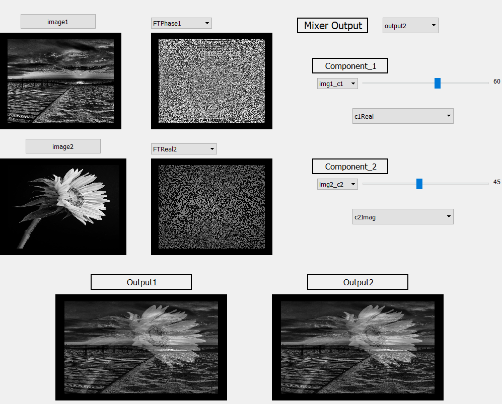

# Image-mixer
## Description
it application used for the fourier transform  image represnetation and to mix between to image by both 
- magnitude and phase 
- real and imaginary
## Features
- used to represent the magnitude-phase 2d image 
- mix between two image 
## python_packages  :
- PyQt5.QtWidgets
- PyQt5.uic
- operator
- imagehash
- librosa
- PIL
- logging
- cv2

## Screenshots:

 

